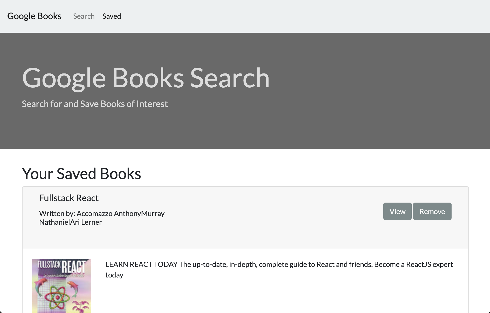

# Google Books Search
A React.js app that searches Google Books, and saves favorites for future purchase.

## Uses

JS/Axios/React/Express/Node

-----------

## Installation Instructions

```
npm install
```

-----------

## Usagage Information

```
npm start
```

-----------

## Live Demo

https://ericks-google-books-search.herokuapp.com

-----------

## Screen shot


-----------

## Code example
```
// fetch google endpoint with search param
// example: https://www.googleapis.com/books/v1/volumes?q=coraline
app.get("/api/google", (req, res) => {
  if (req.query.query) {
    axios.get(`https://www.googleapis.com/books/v1/volumes?q=${req.query.query}`).then((response) => {
      if (response.data.totalItems) {
        const books = response.data.items.map((book) => {
          return {
            _id: book.id,
            title: book.volumeInfo.title,
            authors: book.volumeInfo.authors,
            description: book.volumeInfo.description,
            image: book.volumeInfo.imageLinks ? book.volumeInfo.imageLinks.thumbnail : null,
            infoLink: book.volumeInfo.infoLink
          }
        });
        res.json(books);
      }
      else {
        res.json([]);
      }
    })
  }
  else {
    res.json(false);
  }
});
```

-----------

## Questions
Reach out with additional questions:

[https://github.com/erickmeline](https://github.com/erickmeline) - [erickmeline@gmail.com](mailto://erickmeline@gmail.com)
